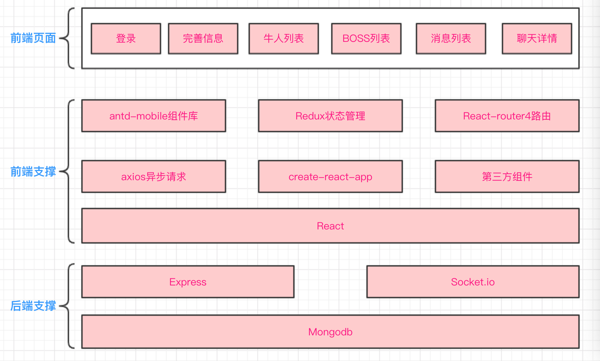
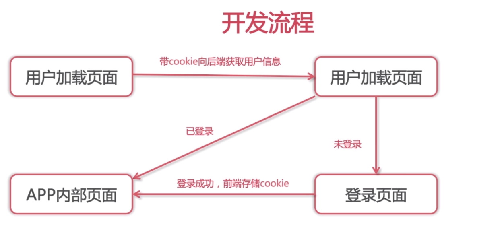

# 项目名称：JOB App

# 项目描述：具有实时聊天功能的招聘App


# 功能：登录注册、信息完善、个人中心、牛人列表、BOSS列表、消息列表、聊天详情页


# 技术栈 

- React 

- Redux: dispatch action reducer state 单向数据流

- React Router

- Node.js	

# 技术架构图



# 代码规范

- ES6

# 文件架构

- src前端源码目录

- server后端express目录

- 功能文件夹：component（组件）, container（页面）, reducers等

## router怎么划分页面

- 进入应用时获取用户信息，用户未登陆跳转login页面

- Login和reigster页面不要权限认证

- 用户信息，聊天列表、职位列表页面共享底部tabbar


## 其它

- Mongodb字段设计

- axios发送异步请求

- redux管理所有数据，组件尽量用antd-mobile，弱化css

# 脚手架命令

- npm install redux --save 安装第三方库redux
- npm run eject 弹出配置文件，可以自定义配置webpack，做到按需加载
- 扩展package.json里的script字段，扩展npm run命令

# Express + mongodb开发web后台接口

- Express开发web接口

- 非关系型数据库mongodb

- 使用node.js的mongoose模块链接和操作mongodb

# Express 

> 基于nodejs，快速、开放、极简的web开发框架

- npm install express --save 安装express

- 监听路由和相应内容，使用nodemon自动重启

- 下载nodemon包：sudo npm install -g nodemon

## 其它的特性

- app.get、app.post分别开发get和post接口

- app.use使用模块

- 代res.send、res.json、res.sendfile响应不同的内容

# Mongodb + mongoose

非关系型数据库

- 下载brew命令行工具：ruby -e"$(curl -fsSL https://raw.githubusercontent.com/Homebrew/install/master/install)"

- 下载Mongodb: brew install mongodb (mac下)

- npm install mongoose --save 安装mongoose 

- 通过mongoose操作mongodb，存储的就是json，相对mysql来说，要易用的多

# Mongoose基础使用

- connect链接数据库

- 定义文档模型，Schema和model新建模型

# Mongoose文档

## Mongoose文档类型

- String, Number等数据类型

- 定义create、remove、update分别用来增、删、改的操作

- find和findOne用来查询数据

# Express + mongodb实战

增删改查

- mongod --config /usr/local/etc/mongod.conf后台启动

- Express结合mongodb

- 封装mongoose

# mongoose数据模型

## 增删改查

- find，findOne查找数据

- update更新数据

- Remove删除数据

# Antd-mobile组件库

蚂蚁金服出品的UI组件库

- 使用npm install antd-mobile@next --save安装最新版

## 按需加载

- 使用 babel-plugin-import, babel-plugin-import 是一个用于按需加载组件代码和样式的 babel 插件（原理）

- 在package.json文件的babel选项下加入```  "plugins": [ ["import", {"libraryName": "antd-mobile","style": "css"} ]]```

# Redux

专注于状态管理的库

- Redux专注于状态管理，和react解耦

- 单一状态，单项数据流

- 核心概念：store、state、action、reducer

## 更近一步

- Redux处理异步，需要redux-thunk中间件

- 使用react-reduc优雅的链接react接redux

## 处理异步

redux默认只处理同步，异步任务需要react-thunk中间件

- npm install redux-thunk --save

- 使用applyMiddleware开启thunk中间件

- action可以返回函数，使用dispatch提交action

# 使用react-redux

- npm install react-redux --save

- 忘记subscribe，记住reducer、aciton、dispatch即可

- React-redux提供Provider和connect两个接口来链接

## React-redux具体使用

- Provider组件在应用最外层，传入store即可，只用一次

- Connect负责从外部获取组件需要的参数

- Connect可以用装饰器的方式来写

## 使用装饰器优化connect代码

- npm run eject弹出个性化配置

- npm install babel-plugin-transform-decorators-legacy插件

- package.json里babel加上plugins配置

# React-router4基础知识

- 安装：npm install react-router-dom --save

- Router4使用react-router-dom作为浏览器端的路由

## 入门组件

- BrowserRouter，包裹整个应用

- Router路由对应渲染的组件，可嵌套

- Link跳转应用

- url参数，Route组件参数可用冒号标识参数

- Redirect组件 跳转

- Switch只渲染一个子Route组件

## 和redux配合

- 复杂redux应用，多个reducer，用combineReducers合并

# 前后端联调

## 使用axios发送异步请求

- 如何发送，端口不一致，使用proxy配置转发

- axios拦截器，统一loading处理

- redux里使用异步数据，渲染页面

- 安装axios：npm install axios --save

- axios.interceptors设置拦截器，比如全局的loading

- axiox.get、post发送请求，返回promise对象

- redux里获取数据，然后dispatch即可

# 登陆验证

## 开发模式

- 基于cookie用户验证：express依赖cookie-parser，需要npm install cookie-parser --save安装

- cookie类似于一张身份卡，登陆后服务端返回，你带着cookie就可以访问受限资源

- 页cookie的管理浏览器会自动处理

## 开发流程



# Socket.io

> 基于事件的实时双向通信库

- 基于websocket协议

- 前后端通过事件进行双向通信

- 配合express，快速开发应用

## Socket.io 和 Ajax的区别

> 基于不同的的网络协议

- Ajax基于http协议，单向，实时获取数据只能轮询

- socket.io基于websocket双向通信协议，后端可以主动推送数据

- 现代浏览器均支持websocket协议

## Socket.io后端API

> 配合express

- io = require(`socket.io`)(http), import io from `socket.io-client`

- io.on 监听事件

- io.emit 触发事件

